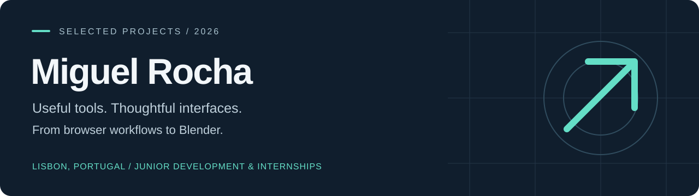
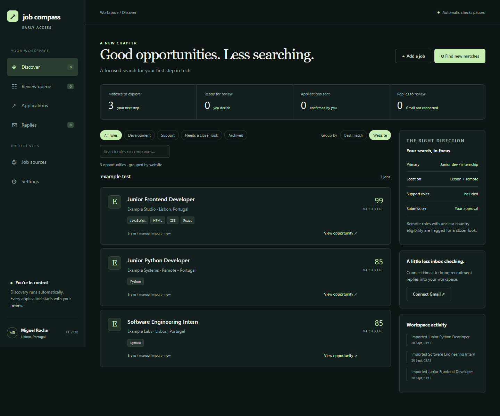
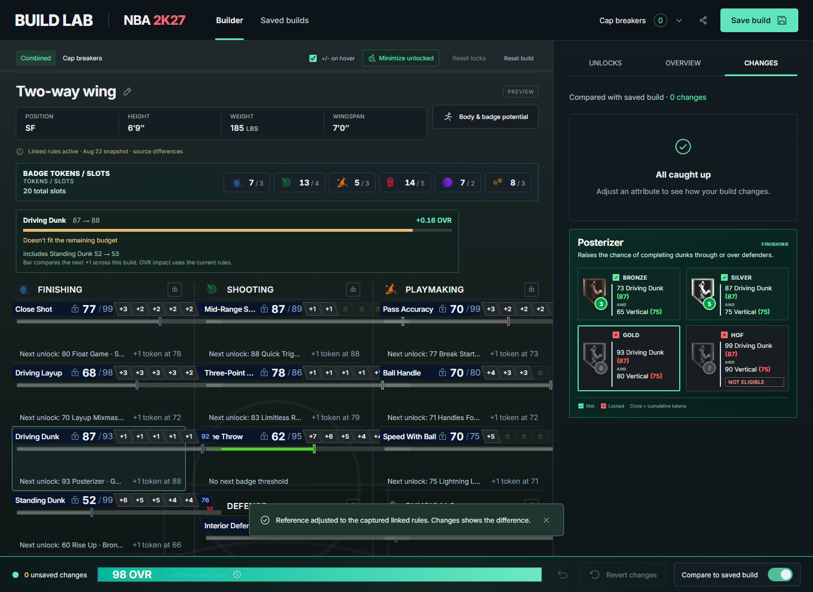

# Building tools for everyday problems

I'm **Miguel Rocha**, based in Lisbon. My projects span web applications, Python services, browser extensions and Blender vehicle modding. I'm looking for **junior developer roles and technology internships in Lisbon or remotely**.

[Start here](#start-here) · [All projects](#all-projects) · [Reviewer guide](docs/REVIEWER-GUIDE.md) · [Validation](docs/VALIDATION.md)

[](https://github.com/mikeywikey-coding/miguel-rocha-projects/actions/workflows/ci.yml)

## Start here

### 01 / Job Compass

**A job search workspace built around review and control.**

Searching across multiple sites makes it easy to lose track of opportunities and replies. Job Compass brings discovery, shortlisting, application preparation and Gmail reply tracking into one local workspace. A Brave companion transfers reviewed details to supported application forms.

`Python` `FastAPI` `SQLite` `OAuth` `JavaScript` `Manifest V3`



_Actual application UI with fictional sample jobs. No mailbox data or personal applications are shown._

- **Engineering focus:** source adapters, duplicate detection, persistent workflow state and encrypted credential storage.
- **Review controls:** edits invalidate approvals; the companion leaves the employer tab open for manual review and submission.
- **Evidence:** 59 Python tests and 15 companion tests run in CI on every push. This copy does not submit applications.

[Explore Job Compass →](projects/job-compass/)

---

### 02 / Build Lab

**Plan an NBA 2K27 build without losing track of linked decisions.**

Changing one attribute can affect the rest of a player build. Build Lab combines a React interface with separate calculation modules, attribute locks, undo, saved builds and comparisons.

`React` `JavaScript` `Vite` `State management` `Node.js tests`



- **Engineering focus:** linked changes, atomic undo, persistent builds, a testable calculation layer and focused UI components.
- **Evidence:** 56 unit tests, 48 Playwright browser tests and the production build run in CI on every push.
- **Scope:** an independent fan project using externally sourced rules, data and calculation inputs. See its source notes for accuracy limitations and attribution.

[Explore Build Lab →](projects/build-lab/)

---

### 03 / BMW M4 ADRO Kit

**A collaborative vehicle mod, from Blender work to a published release.**

Blender was the main tool used for the modelling work on this Forza Horizon 6 mod. The release includes **widebody and standard-body variants**, custom exterior parts, interior styling and in-game colour options.

`Blender` `3D modelling` `Vehicle modding` `Release preparation`

[View the published mod on Nexus Mods ↗](https://www.nexusmods.com/forzahorizon6/mods/469)

This is collaborative work, not a claim of sole authorship. Downloads are available on Nexus Mods; large game archives are not stored here.

## All projects

Explore the full collection, including the four selected browser extensions.

| Project                                                                                                                       | What it does                                                                                        | Main skills                                                      |
| ----------------------------------------------------------------------------------------------------------------------------- | --------------------------------------------------------------------------------------------------- | ---------------------------------------------------------------- |
| [Job Compass](projects/job-compass/)                                                                                          | Discovers relevant jobs, prepares reviewed applications and tracks Gmail replies                    | Python, FastAPI, SQLite, OAuth, API integration, Brave extension |
| [Build Lab](projects/build-lab/)                                                                                              | NBA 2K27 build planning, linked attributes, saved builds and comparisons                            | React, JavaScript, state management, automated tests             |
| [PC Remote](projects/pc-remote/)                                                                                              | Controls a Windows PC from a phone over the local network, with paired devices and hardened sign-in | Python, WebSockets, authentication, pytest, touch interfaces     |
| [Workout Tracker](projects/workout-tracker/)                                                                                  | Logs training, tracks progress and stores workout history                                           | JavaScript, responsive UI, PWA, local storage                    |
| [Travian Settlement Planner](https://github.com/mikeywikey-coding/travian-extensions/tree/main/extensions/NextSettlementCalc) | Estimates when culture points reach settlement thresholds                                           | Data parsing, forecasting, event simulation                      |
| [TravAlarm](https://github.com/mikeywikey-coding/travian-extensions/tree/main/extensions/travAlarm)                           | Tracks game events and schedules browser/audio alerts                                               | Manifest V3, service workers, Chrome APIs                        |
| [Travian QoL](https://github.com/mikeywikey-coding/travian-extensions/tree/main/extensions/TravianQoL)                        | Configurable interface improvements and planning tools                                              | Modular JavaScript, DOM integration, persistent settings         |
| [Travian Night Mode](https://github.com/mikeywikey-coding/travian-extensions/tree/main/extensions/travian_night_mode)         | Persistent dark theme for dynamically changing pages                                                | CSS, MutationObserver, preference synchronisation                |
| [BMW M4 ADRO Kit ↗](https://www.nexusmods.com/forzahorizon6/mods/469)                                                         | Published Forza Horizon 6 vehicle mod with two body variants                                        | Blender, 3D modelling, game modding                              |

## Skills in practice

| Area                      | Examples in this portfolio                                                                |
| :------------------------ | :---------------------------------------------------------------------------------------- |
| **Frontend development**  | React, JavaScript, responsive HTML/CSS, browser storage                                   |
| **Backend & integration** | Python, FastAPI, SQLite, WebSockets, OAuth, external APIs                                 |
| **Browser tooling**       | Manifest V3, content scripts, service workers, DOM integration                            |
| **Testing & workflow**    | Git, GitHub Actions CI, ESLint, Prettier and Black, unit, API, browser and security tests |
| **3D work**               | Blender modelling, vehicle modifications and release packaging                            |

## Explore the repository

Each project has its own README covering its purpose, source structure and how to try it. Applications live under `projects/`; the four selected browser extensions are maintained in [Travian Extensions](https://github.com/mikeywikey-coding/travian-extensions).

Each project is developed in its own repository and copied here for review, so this repository's history starts on 25 September 2026. The portfolio uses the CV name **Workout Tracker**; the app's own screens say **Leg Day**.

Start with Job Compass for a complete dashboard, API integrations and browser companion; Build Lab for React and calculation logic; PC Remote for Python, WebSockets and network security, or [Travian Extensions](https://github.com/mikeywikey-coding/travian-extensions) for browser integration.

## Quality checks

Every push runs [CI](.github/workflows/ci.yml): ESLint and Prettier across the repository, Black for the Python code, unit tests for Build Lab, Job Compass, PC Remote, Workout Tracker, and Build Lab's production build and Playwright browser tests. To run the JavaScript checks locally:

```sh
npm ci
npm run lint && npm run format:check && npm test
```

The Python projects' READMEs cover their own tests.

## Scope and attribution

Game projects are independent fan projects, not official products. Build Lab includes externally sourced rule data and game-related artwork; see [sources and attribution](ATTRIBUTION.md) and its documented accuracy limitations. M4 downloads are hosted on Nexus Mods, not copied into this repository.

No blanket open-source licence is asserted for third-party assets. This repository is initially private. Its GitHub URL becomes suitable for a CV once public access is enabled or a reviewer has been invited.

## Validation and maintenance

See [validation](docs/VALIDATION.md) for what CI covers and what still needs a manual check, [maintenance](docs/PORTFOLIO-MAINTENANCE.md) for updating project copies, and [snapshot provenance](docs/SNAPSHOT-PROVENANCE.json) for source revisions. Job Compass is under active development: applications require review and the companion does not submit them.
