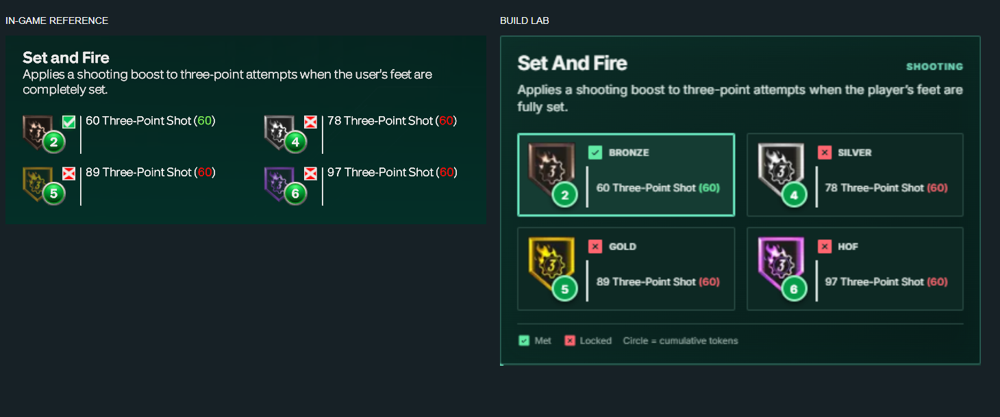

# Build Lab

A React planner for NBA 2K27 player builds, with linked attribute changes, saved-build comparisons and an undoable editing workflow.

**Stack:** React 19, JavaScript, Vite, Playwright, Node.js test runner.



## Features

- Attribute editing with locks, linked attribute rules and atomic undo.
- Body settings, badge requirements and cap-breaker planning.
- Saved builds, side-by-side comparisons, shareable links and image exports.
- Responsive attribute lanes that reflow with the editor's width (CSS container queries).

## Run locally

```sh
npm ci
npm run dev
```

Open `http://127.0.0.1:4173`. `npm run build` produces a static site in `dist/client/`.

## Tests

- `npm test` runs the calculation tests in `tests/*.test.mjs`: linked-attribute rules, cap projections, cost curves, locks and share links.
- `npm run test:ui` starts the dev server and runs the Playwright browser tests in `tests/ui/`: editing flows, saved builds, layout at several widths and typography. It uses Playwright's Chromium; set `PLAYWRIGHT_CHANNEL=msedge` to use an installed Edge instead.

## Source guide

- `src/Builder.jsx` owns the application state and wires handlers to the components in `src/components/`.
- `src/storage.js` restores and saves the draft and the saved-build library, turning every storage failure into a user-facing notice.
- `src/engine/` holds the calculation logic: linked attributes, cap breakers and projections. It has no React dependency, so it is tested directly.
- `src/catalogs/` holds compiled badge, animation and takeover data.

## Accuracy

Game rules and data are externally sourced; this is not an official or fully verified reproduction of the game. See [feature parity](feature-parity.md) and the [dataset notes](research/nba2k27-builder-dataset/README.md). The linked-attribute table in `src/engine/linked-attributes.json` was extracted from a third-party builder and records its provenance.
